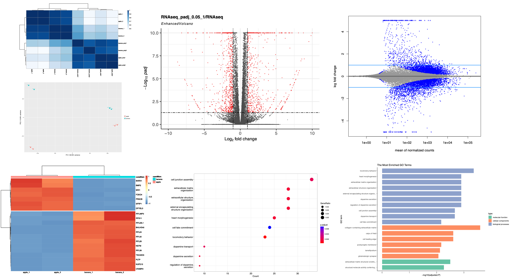

# RNAseqFast
An R package containing functions for basic RNAseq differential expression analysis and GO analysis. 

This package was orignally designed for the downstream analysis after running [RNAseqPE](https://github.com/FengJiang94/RNAseqPE), yet can be used for any mouse or human RNA-seq data. 

To use with RNA-seq data generated using other pipelines, please make sure the input files follow the same format as the example inputs.

Example inputs:
_FeatureCounts_ :Standard outputs of [featureCounts](https://subread.sourceforge.net/featureCounts.html).
_colData.csv_: Simple information.
_counts_matrix.csv_: A mnerged matrix counting the raw gene counts.

This package was designed for data analysis in the following paper, and please consider citing it:

1. Jiang, F., Hedaya, O.M., Khor, E., Wu, J., Auguste, M., & Yao, P. (2023). [RNA binding protein PRRC2B mediates translation of specific mRNAs and regulates cell cycle progression](https://academic.oup.com/nar/article/51/11/5831/7147500). _Nucleic Acids Research_, 51(11), 5831–5846

Some example figures generated by this package:



## Software prerequisites

The following R (>= 3.5.0) packages are required:

```
DESeq2
EnhancedVolcano
clusterProfiler
ggplot2
org.Hs.eg.db
org.Mm.eg.db
pheatmap
RColorBrewer
```

To perform GO analysis, _org.Mm.eg.db_(mouse) and _org.Hs.eg.db_(human) are required. 

## Installation

```
library(devtools)
install_github("FengJiang94/RNAseqFast")

library(RNAseqFast)
```

## Quick start

This package contains the following four functions:

- **MergeFeatureCounts**: A function to merge [featureCounts](https://subread.sourceforge.net/featureCounts.html) outputs into one table.

- **CPM_c** and **TPM_c**: Two functions to calculate CPM and TPM. [Definition of CPM and TPM](https://www.reneshbedre.com/blog/expression_units.html).

- **RNAseqDEGs**: The core function to perform differential expression analysis from raw counts.
This function outputs:
A heatmap of sample correlation
A heatmap of sample distance
A volcano plot showing differential expressed genes
A MA plot
A heatmap showing the top 20 significant differential expressed genes
A matrix containing log2FoldChange and Pvalue for each gene 
A matrix containing log2FoldChange and Pvalue for each coding gene (if lnc=T) 
A matrix containing log2FoldChange and Pvalue for each non coding gene (if lnc=T)

- **GOnKegg**: A function to perform GO and Kegg analysis given a gene list. 

Here is an example  to perform DE analysis for RNA-seq:
Input data used here can be downloaded from [Example inputs](https://github.com/FengJiang94/ExampleData).

```
library(RNAseqFast)

# Set your working directory
# All results will be generated here
CurrPath <- "Example outputs"
setwd(CurrPath)

# Set path to the input data
## Path to the fold containing featureCounts outputs
FeatureCounts <- "Example inputs/FeatureCounts"
## Path to the colData
colDataPath <- "Example inputs/colData.csv"

# Load colData
colData <- read.csv(colDataPath, header = T)

# Merge FeatureCounts outputs in to one table
counts_matrix <- MergeFeatureCounts(FeatureCounts, 
                                    Assay ="Example outputs/RNAseq", 
                                    colDataPath = colDataPath, 
                                    write_to_file = T)

# Calculate CPM
CPM_c(counts_matrix = counts_matrix,
      Assay = "Example outputs/RNAseq")

# Calculate TPM
TPM_c(Assay = "Example outputs/RNAseq",
      counts_matrix = counts_matrix,
      lengthdata = "hg38",
      Plots = T,
      coldata = colData)

# DE analysis 
## Here we compare gene expressin between "apple" and "banana" using total RNA extracted from cell
## This is the most common analysis for RNA-seq
## We subset the colData to include only samples we need for the comparsion. 
## This can aslo be done using the select1 argument 
colData_total <- colData[colData$condition_2 == "total",]
## We convert colData to fators
colData_total$condition <- factor(colData_total$condition, levels = c("banana", "apple"))
## levels = c("Banana", "Apple") make sure the comparsion is made as Apple/Banana
setwd("Example outputs")
ApplevsBanana <- RNAseqDEGs(coldata = colData_total,
                            counts_matrix = counts_matrix,
                            filename = "RNAseq",
                            By = "padj", 
                            lfc = 1, 
                            LRT = F,
                            Design = ~ condition,
                            intgroup = "condition",
                            lnc = T,
                            shrinkcoef = 2,
                            lnc_ref = "human",
                            plot_coding = T,
                            tpm_file = "RNAseq_tpm.csv")
## check result                            
ApplevsBanana[[3]]

## Another example for DE analysis
## polysome-seq analysis
## Here we compare the transaltion efficiency (TE) between "apple" and "banana" using total RNA extracted and polysome associated RNAs from cell.
## This is an old fashined way to calculate TE, yet still used by some labs.
## To do this, colData should have a column telling whether a sample is from total RNA or polysome associated RNA.
colData$condition_2
## This column should be fators.
colData$condition_2 <- factor(colData$condition_2, levels = c("total", "polysome"))
## it is important to set levels = c("total", "polysome") since transaltion efficiency (TE) is calculated by polysome/total
## levels = c("Banana", "Apple") make sure the comparsion is made as Apple/Banana
colData$condition <- factor(colData$condition, levels = c("banana", "apple"))
## analysis
ApplevsBananaTE <- RNAseqDEGs(coldata = colData,
                              counts_matrix = counts_matrix,
                              filename = "TE",
                              By = "padj", 
                              lfc = 1, 
                              LRT = T,
                              Design = ~ condition + condition_2 + condition:condition_2,
                              reduced = ~ condition + condition_2,
                              intgroup = "condition",
                              lnc = T,
                              shrinkcoef = 4,
                              lnc_ref = "human",
                              plot_coding = T,
                              tpm_file = "RNAseq_tpm.csv")

## check results
ApplevsBananaTE[[3]]

# GO and KEGG analysis
## Here we perform GO and KEGG analysis for genes upregulated in Apple by at least 2 folds
ApplevsBanana <- as.data.frame(ApplevsBanana[[3]])
genes <- rownames(ApplevsBanana[ApplevsBanana$log2FoldChange > 1 & ApplevsBanana$padj < 0.05, ])
## Go and KEGG
GOnKEGG(sign_de_gene = genes, filename = "RNAseq")
```
Output for the above script can be downloaded from the [Example Outputs](https://github.com/FengJiang94/ExampleData).


